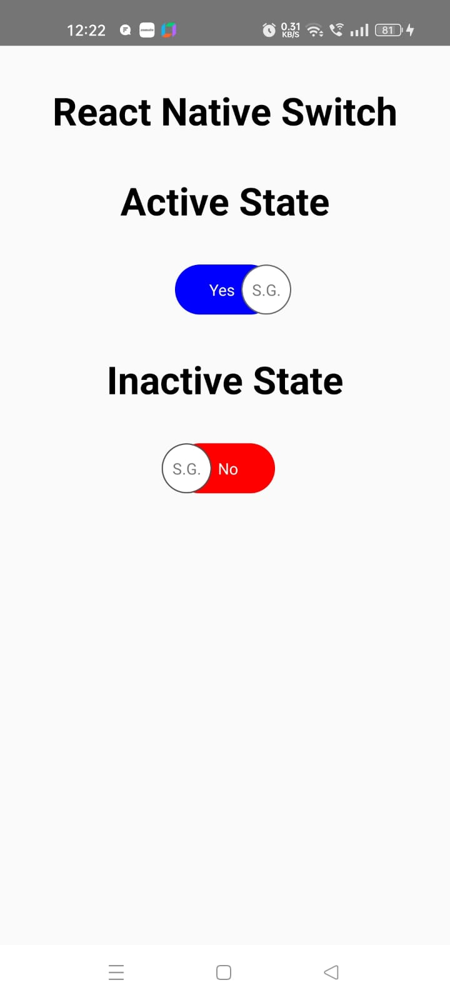

## React Native Switch Button

- Welcome to our comprehensive guide on React Native Switch Buttons! In this in-depth tutorial, we dive deep into the world of switch buttons in React Native, exploring their functionalities, implementation, and customization. Whether you're a beginner looking to grasp the basics or an experienced developer aiming to enhance your app's user interface, this video has something for everyone.
- Throughout this tutorial, we'll provide clear explanations, practical examples, and hands-on demonstrations to ensure you gain a solid understanding of React Native switch buttons. Whether you're building a mobile app, improving user experience, or simply expanding your development skills, this video is your go-to resource.
- Checkout the detailed tutorial [here](https://youtu.be/ZeniQLEXC5U)

### What will we be building?

|  |
| :-------------: |